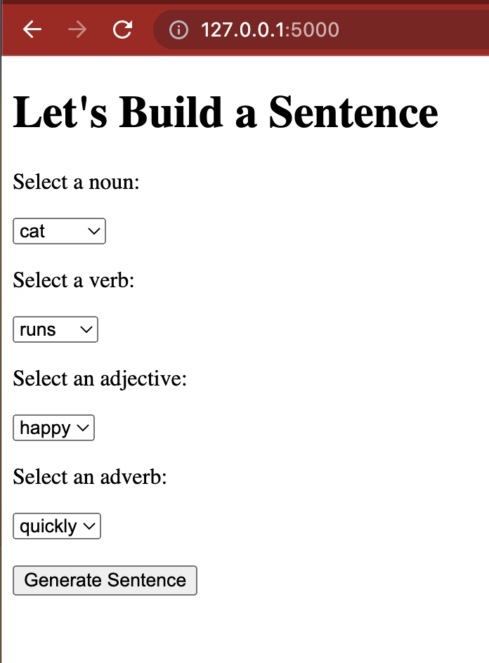

# Sentence Generation Game
[](https://www.python.org)
[](https://flask.palletsprojects.com/en/2.2.x/)


- Dynamic & Interactive Build Sentence Generation Game using Python and Flask
- One player for the game
- Players can choose words from nouns, verbs, adverbs, adjectives from library

## Learning Goals
Major things that I want to focus on learning in this project
- Create local Python web application using Flask, Jinja2 and HTML.
- Get familiar with Python and Flask - build u a local host, get. function, creating a sentences from raw words.

## Technology
- Python 3.11
- Flask
- Venv

## Installation
```bash
pip3 install -r requirements.txt
```

## Usage

```bash
flask run
```

* For hot reloading: `flask --app app.py --debug run`

## ScreenShot
<p align="center">
  
</p>

## Connect with me!

[](https://linkedin.com/in/annieyentran/)  [](https://github.com/momofAnAl)

## Email Me :e-mail:
[](mailto:anhtr077@gmail.com)

